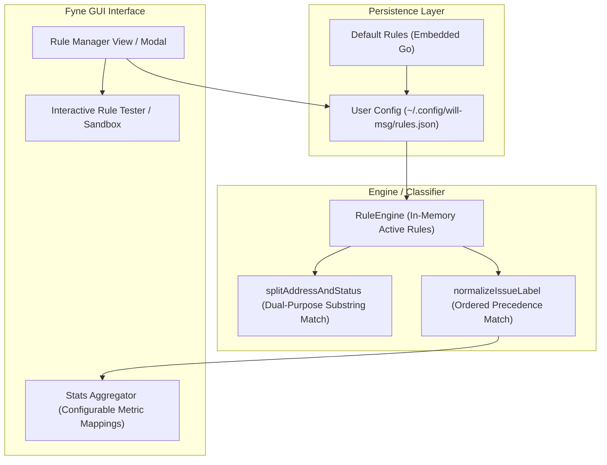

# Implementation Plan: Built-in Rule Editor for Label & Issue Classification

## 1. Executive Summary & Feasibility Verdict

**Feasibility Rating: HIGH (Moderate Complexity, High Impact)**

Building an in-app editor to manage, reorder, and customize issue-to-label classification rules is very feasible and fits cleanly into the existing Go + Fyne architecture.

The core classification logic is currently centralized in `main.go`. Decoupling these rules from hardcoded code constants into a persistent configuration model requires modest refactoring, and Fyne provides all necessary UI primitives (`widget.Table`, `widget.List`, `dialog.ShowCustom`, `fyne.App.Preferences()`, and file dialogs).



---

## 2. Current Architecture & Technical Constraints

An effective editor must account for four critical facets of how rules operate today:

### A. Dual-Purpose Usage of Pattern Tables

In `main.go`, the `issuePatterns` slice is used in two distinct stages:

1. **Address vs. Status Splitting (`splitAddressAndStatus`, line 678):** When an entry lacks a standard street suffix (e.g. `23 AND 25 KILSYTH MSW AND RECYC NOT OUT`), the parser scans for known issue patterns to locate where the address ends and the status starts.
2. **Label Assignment (`normalizeIssueLabel`, line 725):** The first matching pattern assigns the label.

> **Constraint:** Any user modifications to substring patterns must immediately update both address splitting and label normalization.

### B. Strict First-Hit Order Precedence

Substring matching iterates sequentially over `issuePatterns`. More specific phrases **must** precede general ones (e.g., `"MSW AND RECYC NOT OUT"` must appear before `"RECYC NOT OUT"`, otherwise `"RECYC NOT OUT"` matches prematurely).

> **Constraint:** The editor must allow users to reorder rules (Move Up / Move Down or Drag & Drop) to control precedence.

### C. Multi-Tiered Classification Strategy

Currently, classification executes in tiers:

1. **Tier 1:** Exact substring matching (`issuePatterns`).
2. **Tier 2:** Regex patterns (`\bBLOCK(?:ED|ING|S)?\b` $\rightarrow$ `blocked`, `\bOVERFLOW...\b` $\rightarrow$ `overflowing`).
3. **Tier 3:** Dynamic heuristic (snake_case conversion + checking if suffix ends in `_not_out` $\rightarrow$ `special_item_not_out`).
4. **Tier 4:** Fallback default (`other`).

> **Constraint:** A basic editor can focus on Tier 1 (substring patterns and labels), while an extensible design allows adding custom Regex rules and toggling heuristics.

### D. Downstream Dependency: Statistics Engine (`stats.go`)

`stats.go:ComputeStats()` aggregates records into daily metrics based on specific labels:

- `msw_not_out` $\rightarrow$ `TrashNotOut++`
- `recyc_not_out` $\rightarrow$ `RecyclingNotOut++`
- `msw_and_recyc_not_out` $\rightarrow$ both counters incremented.

> **Constraint:** The rule editor should either preserve these standard labels or allow the user to map custom labels to metric categories (Trash / Recycling / None).

---

## 3. Data Model & Storage Design

### A. Go Struct Definitions

```go
package main

type RuleType string

const (
    RuleTypeSubstring RuleType = "substring"
    RuleTypeRegex     RuleType = "regex"
)

type MetricContribution string

const (
    MetricNone      MetricContribution = "none"
    MetricTrash     MetricContribution = "trash"
    MetricRecycling MetricContribution = "recycling"
    MetricBoth      MetricContribution = "both"
)

type ClassificationRule struct {
    ID          string   `json:"id"`
    Pattern     string   `json:"pattern"`      // e.g. "MSW AND RECYC NOT OUT" or "\\bBLOCKED\\b"
    Type        RuleType `json:"type"`         // "substring" or "regex"
    Label       string   `json:"label"`        // e.g. "msw_and_recyc_not_out"
    Description string   `json:"description"`  // User note
    Enabled     bool     `json:"enabled"`
}

type LabelDefinition struct {
    Key         string             `json:"key"`         // e.g. "msw_not_out"
    DisplayName string             `json:"display_name"`// e.g. "Trash Not Out"
    Metric      MetricContribution `json:"metric"`      // "trash", "recycling", "both", "none"
}

type RuleConfig struct {
    Version          int                  `json:"version"`
    EnableHeuristics bool                 `json:"enable_heuristics"` // Enable _not_out fallback
    DefaultLabel     string               `json:"default_label"`     // "other"
    Labels           []LabelDefinition    `json:"labels"`
    Rules            []ClassificationRule `json:"rules"`             // Ordered list
}
```

### B. Persistence Strategy

1. **Config Directory:** Store user rules at `os.UserConfigDir()/will-msg/rules.json` (e.g. `~/Library/Application Support/will-msg/rules.json` on macOS, `%APPDATA%\will-msg\rules.json` on Windows).
2. **Built-in Fallback:** If the file does not exist or is corrupted, initialize from an embedded default configuration that matches the current hardcoded rules.
3. **Import/Export:** Support exporting to and importing from `.json` files via native file pickers (`zenity` / Fyne storage).

---

## 4. UI / UX Design in Fyne

### A. Navigation & Access

- Add a **"Rules & Labels"** button in the top header bar (next to the title/subtitle) or an action button on the main workspace.
- Opens a dedicated modal dialog or switches the view to the Rule Manager.

### B. Rule Management Screen Components

```
+-------------------------------------------------------------------------------+
| Rules & Labels Manager                                        [X] Close       |
+-------------------------------------------------------------------------------+
| [ + Add Rule ]  [ Move Up ]  [ Move Down ]  [ Reset Defaults ]  [ Export/Import ]|
+-------------------------------------------------------------------------------+
| Precedence | Type      | Pattern                        | Target Label  | On  |
|------------|-----------|--------------------------------|---------------|-----|
| 1          | Substring | MSW AND RECYC NOT OUT          | msw_and_...   | [x] |
| 2          | Substring | MSW NOT OUT                    | msw_not_out   | [x] |
| 3          | Substring | RECYC NOT OUT                  | recyc_not_out | [x] |
| 4          | Regex     | \bBLOCK(?:ED|ING|S)?\b         | blocked       | [x] |
| ...        | ...       | ...                            | ...           | ... |
+-------------------------------------------------------------------------------+
| Live Rule Tester / Sandbox:                                                   |
| Test Input: [ 45 FOREST ST TRASH AND RCY NOT OUT 0830AM                     ] |
| Result:     Address: "45 FOREST ST"  | Status: "TRASH AND RCY NOT OUT"        |
|             Label:   "msw_and_recyc_not_out" (Matched Rule #1)                |
+-------------------------------------------------------------------------------+
| [ Save & Apply ]                                           [ Cancel Changes ] |
+-------------------------------------------------------------------------------+
```

1. **Rule List Table (`widget.Table` or `widget.List`):**
   - Displays priority rank, pattern, match type, target label, and enabled status.
   - Selecting a row enables **Move Up**, **Move Down**, **Edit**, and **Delete**.
2. **Add / Edit Rule Dialog (`dialog.NewCustom`):**
   - Pattern input field (auto-trimmed and uppercase-normalized for substring rules).
   - Type selector (`Substring` vs. `Regex`).
   - Target Label dropdown (select from known labels or enter a new label).
   - Metric association selector (for `stats.go`).
3. **Interactive Live Tester (Sandbox):**
   - An entry field where the user can paste actual message lines (e.g. `14 DARTMOUTH ST RECYC CONTAM`).
   - Displays instant parsing feedback: detected address, detected status, matching rule index, and final assigned label.
4. **Safety Actions:**
   - **"Reset to Defaults"** with confirmation dialog.
   - **"Export Rules"** / **"Import Rules"** to share configurations across machines.

---

## 5. Implementation Steps & Refactoring Roadmap

### Phase 1: Engine Decoupling & Configuration Engine

- [x] Create `config.go` containing struct definitions, JSON serialization, and default configuration constants.
- [x] Create `engine.go` encapsulating `RuleEngine` / `Classifier`:
  - Methods: `NewRuleEngine(cfg RuleConfig)`, `Classify(raw string) (location, status, label, issueTime)`, `SplitAddress(raw string) (address, status)`.
- [x] Refactor `main.go` functions (`classifyEntry`, `splitAddressAndStatus`, `normalizeIssueLabel`, `parseRecords`) to use the `RuleEngine` instance rather than package-level variables.
- [x] Update `stats.go` to use the label-to-metric mappings defined in the engine config.
- [x] Ensure all existing unit tests in `main_test.go` and `stats_test.go` pass seamlessly with default configuration.

### Phase 2: Configuration Persistence & File I/O

- [x] Implement `LoadConfig()` and `SaveConfig(cfg RuleConfig)` with fallback to default rules.
- [x] Implement JSON export and import with schema validation (e.g., verifying regex compilation and preventing duplicate IDs).
- [x] Add unit tests for config load, save, migration, and invalid JSON recovery.

### Phase 3: Fyne GUI Rule Editor

- [x] Build the Rule Manager UI layout in `gui_rules.go`:
  - List/Table with custom cell renderers.
  - Form inputs for Adding/Editing individual rules.
  - Move Up / Move Down buttons to reorder slice items.
- [x] Connect the "Rules & Labels" button in the main GUI header.
- [x] Wire up "Save & Apply", refreshing active engine state for subsequent file parsing runs.

### Phase 4: Interactive Sandbox & Testing Suite

- [x] Implement the Live Rule Tester widget in the editor footer, running test input through `engine.Classify()` on every keystroke.
- [x] Add automated UI and integration tests verifying:
  - Adding a custom pattern changes output CSV labels.
  - Reordering rules changes matching precedence.
  - Resetting restores original default behavior.

---

## 6. Risk Assessment & Mitigations

| Risk                                | Impact                       | Mitigation                                                                                                                        |
| :---------------------------------- | :--------------------------- | :-------------------------------------------------------------------------------------------------------------------------------- |
| **Malformed Regex in Custom Rules** | Crash or parsing failure     | Validate regex compilation on input; reject invalid patterns before saving.                                                       |
| **Address Splitting Regression**    | Incorrect address extraction | Run the address suffix check _first_ before pattern splitting, and provide the Live Sandbox for instant verification.             |
| **Config File Corruption**          | App failure on launch        | Wrap JSON decoding in safe error handling: if parsing fails, log warning, backup broken file, and fall back to built-in defaults. |
| **Broken Stats Calculations**       | Daily metrics inaccurate     | Ensure all rules are tagged with an explicit metric category (`Trash`, `Recycling`, `Both`, `None`).                              |

---

## 7. Recommendation

Proceed with the phased implementation. Starting with **Phase 1 (Engine Decoupling)** and **Phase 2 (Config Persistence)** provides immediate architectural cleanliness and testability without UI risk. **Phase 3 and 4** then deliver the full graphical editor and live preview sandbox to the user.
